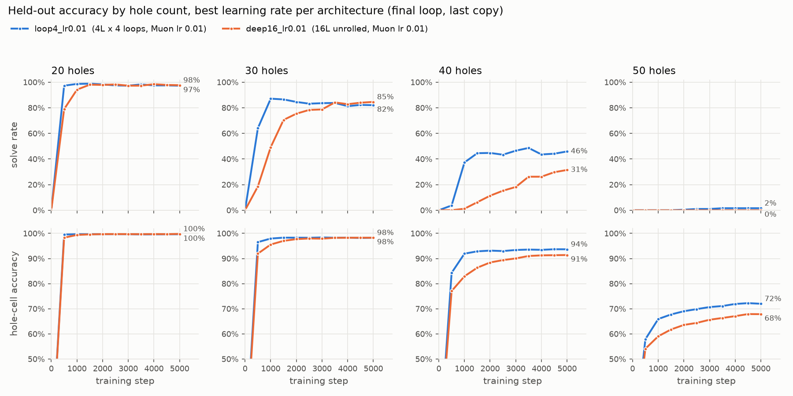
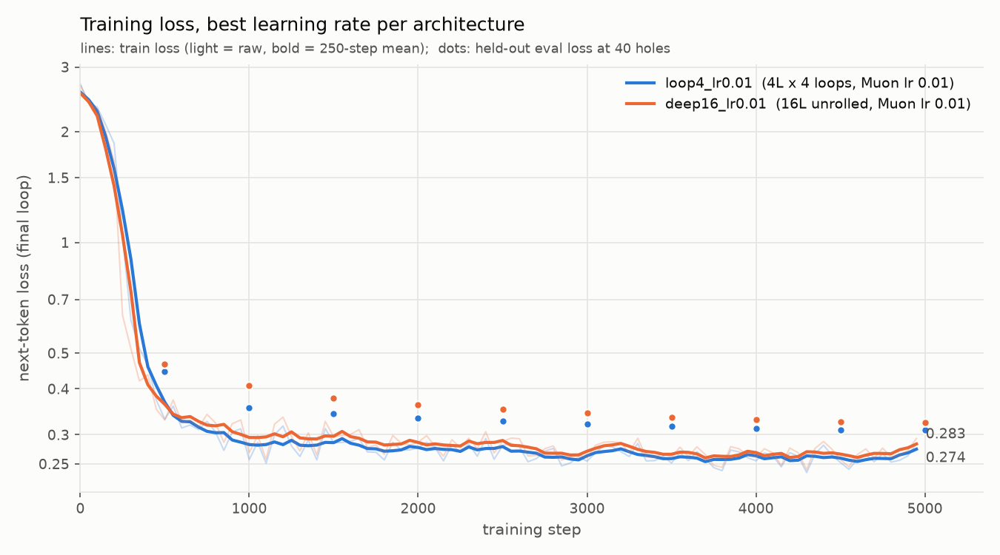

# ParLatent: Parallel Latent Space Reasoning

## Overview
This project showcases a small transformer-based model trained to solve sudoku puzzles with parallel latent space reasoning via layer looping. Unlike traditional chain of thought techniques, all reasoning is implicit in latent space with the reasoning tokens being the arbitrary placeholder HOLE. Since the reasoning tokens are static and arbitrary, they do not need to be sampled one at a time by the model and instead can be prefilled simulateously, enabling massively parallel reasoning. I show that the 4 layer model looped 4 times outperforms the 16 layer non-looped variant on sudoku puzzles.

## Results



The looped variant learns faster and exceeds or matches the non-looped at every tested puzzle difficulty except for 30 holes where it narrowly loses by the end at 82% vs 85%, respectively. For 40 holes, the looped vastly exceeds the non-looped at 46% vs 31%.



The looped variant's average per loop loss falls and ends below the non-looped's loss at 0.259 vs 0.267.

## Architecture

The backbone of the model is multi head attention with rotary position embeddings. The feedforwards each comprise two matmuls with a relu^2 activation instead of the common SwiGLU layer. After each loop, the hidden state is normed and the token embedding is added to preserve the token signal throughout all loops. Cross entropy loss is computed after each loop with the average over all loops as the final loss. This helps propagate the gradient signal throughout all loops as otherwise the rmsnorm on the hidden state each loop can potentially bottleneck the gradient flow.

Below is pseudo code
```
    tok_emb = embeddings[toks]
	x = tok_emb
	
	for l in nloops:
		x = hidden_norm(x) + tok_emb_norm(tok_emb)
		for block in blocks:
			x = block(x)
		logits = proj(proj_norm(x))
		loss += cross_entropy(logits, targets)
	loss /= nloops
```

## Data

The token set is {`<holed>`, `</holed>`, 1-9, _, |, `<solved>`, `</solved>`}.
`<holed>` designates the start of a sudoku puzzle with holes and `</holed>` the end.
_ is the hole token and | is the row separator.
`<solved>` and `</solved>` designate the final solved puzzle.

Input training sequences are formatted like so:
```
[<holed>, 7, _, 1, 6, 4, 3, _, 2, 8, |,
 1, ..., </holed>, <solved>, _, _, _, ..., |, 
 ..., </solved>, <solved>, ..., </solved>]
```

The sequences are generate synthetically with the number of holes in each puzzle is sampled uniformly ~[0, 50].

Output sequences are similar but with all holes of the `<solved>` puzzles filled in with the correct numbers. The model is trained to predict the next token of the output sequences for every input token.

## Training
The muon optimizer is used for the weight matrices while AdamW is used for the embeddings and all other parameters.

The number of loops is chosen to equal the number of `<solved>` puzzles in the training sequences so that each `<solved>` prediction can be a refinement of the previous full `<solved>` prediction. This project uses 4 `<solved>` puzzles and 4 loops for the looped variant. The non-looped variant also uses 4 `<solved>`, but with 16 distinct layers.

The learning rate grid {0.005, 0.01, 0.02, 0.04, 0.08} was run for the looped and non-looped architectures over 5000 steps and the best lr was 0.01 for both. The looped variant demonstrated overall faster learning and solution accuracy over the non-looped variant despite having ~4x fewer parameters.